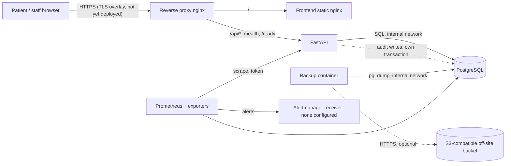

# Data flows, encryption and environment separation

Based on the repository at commit `5d49174`. No staging or production deployment exists, so geographic location of every external destination is **unknown** and must be filled in before any real data is processed.

## Production-style topology (from `docker-compose.prod.yml`)

Networks: `edge` (proxy, frontend, backend) and `data` (internal, no external route: db, backend, backup, migrate, postgres-exporter). PostgreSQL has no published port in production compose.

## Flows

| # | Sender -> recipient | Data | Purpose | Transport protection | Storage | Third party / location |
|---|---|---|---|---|---|---|
| 1 | Browser -> proxy | Credentials, all clinical data in requests/responses | Use the application | TLS required for production (`COOKIE_SECURE=true` enforced; TLS overlay exists; **not yet deployed or verified**) | None at proxy except access log | Hosting provider **[TO CONFIRM]** |
| 2 | Proxy -> FastAPI | Same, plus `X-Forwarded-*` | Routing | Internal Docker network, plain HTTP | Access log: time, client IP, method, path (no query), status, duration | Same host |
| 3 | FastAPI -> PostgreSQL | All application data | Persistence | Internal network; no `sslmode` in the URL (unencrypted inside the Docker network) | Database volume | Same host |
| 4 | FastAPI -> audit table | Audit events (own transaction) | Accountability | As flow 3 | `audit_logs` | Same host |
| 5 | FastAPI -> stdout | Request log, auth events (user id, no email) | Operations | Docker log driver (`json-file`, 10 MB x 5) | Host disk | Same host |
| 6 | Backup container -> PostgreSQL | Full dump | Recovery | Internal network | `/backups` volume, 14 days default | Same host |
| 7 | Backup -> off-site bucket | Dump + checksum | Off-host recovery copy | HTTPS to the S3 API; server-side encryption selectable (`OFFSITE_S3_SSE`, default AES256 when set) | Bucket, 30 days default | Provider and region **[TO CONFIRM]** |
| 8 | Prometheus/exporters -> app/db | Request counts by method/status class, DB stats, host/container stats, backup status. No identifiers | Monitoring | Internal `monitoring` network; metrics endpoint needs a token and is not public | Prometheus volume (15 days) | Same host |
| 9 | Alertmanager -> receiver | Alert name, severity, instance | Notify an operator | Depends on receiver; **none configured** | Receiver | **[TO CONFIRM]** |
| 10 | Restore -> temporary database | Dump copy | Recovery test / DR | Isolated network in the drill; must be deleted after use | Temporary volume | Same host |
| 11 | Email | **None.** No email provider exists; invitation tokens are returned to the inviter in the API response and shared out of band | n/a | n/a | n/a | n/a |
| 12 | Support | **None.** No support tooling or role | n/a | n/a | n/a | n/a |
| 13 | Frontend -> third parties | **None.** No CDN, fonts, analytics or error tracking; bundle only calls same-origin `/api` | n/a | n/a | n/a | n/a |

## Encryption review

| Layer | Status | Evidence / gap |
|---|---|---|
| Browser to proxy (in transit) | Required, **not yet evidenced end to end** | `COOKIE_SECURE` forced true in production; HSTS header in production mode; TLS overlay example in repo. No deployed host to verify certificates |
| Proxy to backend, backend to DB (in transit) | **Not encrypted** (plain inside the private Docker network) | Accepted for a single host; revisit if services ever span hosts |
| Backup upload (in transit) | HTTPS to the S3 endpoint when the endpoint is HTTPS | Drill used a local HTTP endpoint; production must use HTTPS |
| PostgreSQL data at rest | **Not evidenced** | Depends on host volume encryption (required by `docs/p7-production-host.md`, "None exists yet"). No application-level encryption of columns |
| Host disk / Docker volumes at rest | **Not evidenced** | Same as above |
| Backups at rest | **Partly**: server-side encryption can be requested; bucket-side encryption and key ownership **not evidenced**. Local `/backups` volume relies on host disk encryption | Do not claim "encrypted at rest" until provider evidence exists |
| Logs at rest | Host disk only, rotated | Same host-disk dependency |
| Passwords | Argon2id hashes | Code |
| Invitation tokens | SHA-256 digest stored | Code |

**Conclusion:** transport and credential protection are implemented in code; encryption at rest is a deployment requirement with no evidence yet. This is a pilot blocker for real data, not an engineering gap in the application. **[DECISION: security/operations]**.

## Environment separation

| Aspect | Finding |
|---|---|
| Databases | Dev compose uses database `myvita` on a named volume with static dev credentials (`myvita/myvita`); production compose has no defaults and requires `POSTGRES_*` |
| Secrets | Production compose fails if `JWT_SECRET_KEY` etc. are unset (`:?`); `ENVIRONMENT=production` refuses weak secrets, wildcard hosts/origins and insecure cookies |
| Domains | Production requires `PUBLIC_DOMAIN`, explicit `ALLOWED_HOSTS`/`CORS_ORIGINS` |
| Accidental cross-connection | A staging stack can only reach the production database if someone supplies production credentials and network access; nothing in the repo contains them. Compose project names and volumes are separate per project (verified during drills with `-p`) |
| Debug / docs | `ENVIRONMENT=production` disables `/docs` and `/openapi.json` |
| Staging seed | `backend/scripts/seed_staging.py` refuses to run unless `STAGING_SEED_CONFIRM=yes` and refuses databases containing non-seed clinics |

Residual risk: the dev compose publishes PostgreSQL on a host port (5433) with a trivial password. It must never run on a networked host with real data.
